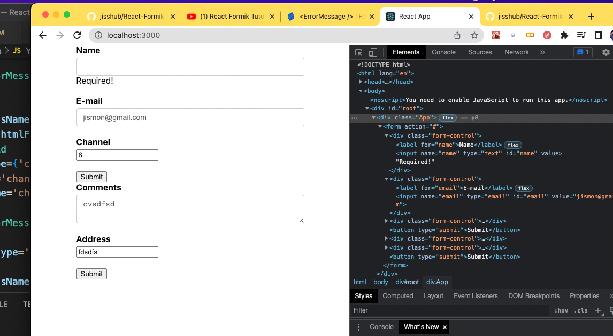

# React-Formik-Tutorial

[Formik](#Formik) 

[useFormik Hook](#useformik-hook)

[Managing Form State](#managing-form-state)

[Handling Form Submission](#handling-form-submission)

[Form Validation](#form-validation)

[Displaying Error Messages](#displaying-error-messages)

[Visited Fields](#visited-fields)

[Improving Validation UX](#schema-validation-with-yup)

[Schema validation with Yup](#schema-validation-with-yup)

[Reducing Boilerplate/Code Refactoring](#reducing-boilerplatecode-refactoring)

[Formik Component](#formik-component)

[Field Component](#field-component)

[ErrorMessage Component](#errormessage-component)

[Fields Revisited](#fields-revisited)

[Error Message Revisited](#error-message-revisited)


# Formik

Formik is a library that helps you deal with forms in React.

```js
function YoutubeForm() {
  return (
    <div>
        <form>
            <label htmlFor='name'>Name</label>
            <input type="text" id="name" name='name' />

            <label htmlFor='email'>E-mail</label>
            <input type={'email'} id='email' name='email' />

            <label htmlFor='channel'>Channel</label>
            <input type={'channel'} id='channel' name='channel' />

            <button type='submit'>Submit</button>
        </form>
    </div>
  )
}
```
# useFormik Hook

https://www.youtube.com/watch?v=tEU5k2O5qSU&list=PLC3y8-rFHvwiPmFbtzEWjESkqBVDbdgGu&index=3


Run below command to add formik to our project.

```bash
npm add formik
```

# Managing Form State

https://www.youtube.com/watch?v=c4EdCbk3K1c&list=PLC3y8-rFHvwiPmFbtzEWjESkqBVDbdgGu&index=4

- Managing form state using formik.
- **Form State** is an obect that maintains the values of different form fields.


## 1. Set initial values for our forms using *initialValues* property.

```js
const formik = useFormik({
      initialValues: {
        name: '',
        email: '',
        channel: ''
    }
});
```

## 2. Set onChange and value property to our input fields to access form data.

```js
 <input 
    type="text" 
    id="name" 
    name='name'
    onChange={formik.handleChange}
    value={formik.values.name}
  />
```

- Once we set *onChange* and *value* property in our inputs, *formik* will automatically track the form field values.

- *onChange* event is added to all the inpout that needs rto be tracked.

- *handleChange* method reads the *name* attribute and updates the corresponding property in the *values* object. 

- *values* object contains the values for all the form fields.

- We can access them individually and assign them to value property of the form fields.


## WorkFlow

1. First take the values from *initialValues* object and set them in the values obect.

2. Then when we change field values, it fires the handleChange methods which will update the values object. When values object is udpated, it is passed back into the form fields. This cycle ensures that form state is managed correclty. 

3. *formik.values* give access to form data.


# Handling Form Submission

https://www.youtube.com/watch?v=DZiltZH1-d0&list=PLC3y8-rFHvwiPmFbtzEWjESkqBVDbdgGu&index=5

```js
const formik = useFormik({
      initialValues: {
        name: '',
        email: '',
        channel: ''
      },
      onSubmit: values => {
        console.log('form data', values)
      }
    });

  return (
    <div>
        <form onSubmit={formik.handleSubmit}>
      </div>
```

## Steps

1. In form tag, we specify *onSubmit* prop and set it equal to *formik.handleSubmit*.

2. *onSubmit* method receives the latest values of form data as its argument.
 
# Form Validation

https://www.youtube.com/watch?v=tthHwRRGkj0&list=PLC3y8-rFHvwiPmFbtzEWjESkqBVDbdgGu&index=6

For every field, we add required attributes. In other all fields are important and neds to implementated,


- After cleaning the codebase, Here we take *initialValues* property, *onSubmit* and *validate* function outside the main function. In *useFormik* hook, we pass above ones as arguments.

```js
import React from 'react';
import {useFormik} from 'formik';

  const initialValues = {
    name: '',
    email: '',
    channel: ''
  }

  const onSubmit = values => {
    console.log('form data', values)
  }

  const validate = values => {
    let errors = {}
    if (!values.name) {
        errors.name = 'Required'
    } if (!values.email) {
        errors.email = 'Required'
    } else if (/^\w+([\.-]?\w+)*@\w+([\.-]?\w+)*(\.\w{2,3})+$/.test(values.email)) {
        errors.email = 'Invalid email format';
    }
    if (!values.channel) {
        errors.channel = 'Required';
    }
    return errors;
  }
  function YoutubeForm() {
    const formik = useFormik({
      initialValues,
      onSubmit,
      validate
    });
  return (
    <div>
        <form onSubmit={formik.handleSubmit}>
            <label htmlFor='name'>Name</label>
            <input 
              type="text" 
              id="name" 
              name='name'
              onChange={formik.handleChange}
              value={formik.values.name}
            />

            <label htmlFor='email'>E-mail</label>
            <input 
              type={'email'} 
              id='email' 
              name='email'
              onChange={formik.handleChange}
              value={formik.values.email}
            />

            <label htmlFor='channel'>Channel</label>
            <input 
              type={'channel'} 
              id='channel'
              name='channel'
              onChange={formik.handleChange}
              value={formik.values.channel}
            />

            <button type='submit'>Submit</button>
        </form>
    </div>
  )
}
export default YoutubeForm;
```
# Displaying Error Messages

Display error messages only if it exists. For that we use conditional rendering.

```js
<input 
    type="text" 
    id="name" 
    name='name'
    onChange={formik.handleChange}
    value={formik.values.name}
  />
  {formik.errors.name ? 
    <div>
      {formik.errors.name}
    </div>: null
  }
```

If the errors exist in name input, we render the div element. Similarly we write error messages for other inputs as well.

## Workflow

1. First we create a *validate* function and pass it to *useFormik* hook.

2. *validate* function checks the value of form field and basically populate the objects with appropriate error messages.

# Visited Fields

https://www.youtube.com/watch?v=GGl__utJ0t0

- We have to store the visited fields in an object called *touched*. Ie if we touch an input field we have to store that information in an object called *touched*.

- **formik.touched** 

- *touched* gives an information about whether a field has been visited or not.

```js
console.log("Form Touched", formik.touched);
```

# Improving Validation UX

Show the error message only if the field is visited and error exist.

We use touched object to conditionally render error messages on our front end.

```js
{formik.touched.name && formik.errors.name ? 
  <div className='error'>
    {formik.errors.name}
  </div>: null
}

{formik.touched.email && formik.errors.email ? 
  <div className='error'>
    {formik.errors.email}
  </div>: null
}
```

Here if user touches the field and if there is an error, We display the div tag with error message.
We use **touched** object here. 

# Schema validation with Yup

https://www.youtube.com/watch?v=PpdXB9Ru6oI&list=PLC3y8-rFHvwiPmFbtzEWjESkqBVDbdgGu&index=11

1. Install yup using npm

```bash
npm install yup
```

2. Set a validation schema for our inputs.

```js
const validationSchema = Yup.object({
  name: Yup.string().required('Required'),
  email: Yup.string()
          .email('Invaid Email Format')
          .required('Required'),
  channel: Yup.string().required('Required')
});
```

3. Update the *useFormik* hook by adding *validationSchema* function as an argument.

```js
const formik = useFormik({
  initialValues,
  onSubmit,
  validationSchema
});
```

# Reducing Boilerplate/Code Refactoring

https://www.youtube.com/watch?v=Gcs9cBI2Cw8&list=PLC3y8-rFHvwiPmFbtzEWjESkqBVDbdgGu&index=12

- We can observe here that same code is repeated in every inputs. For example, *onChange* event, *onBlur* events and *value* attribute all present in the every input fields. So we can replace these lines of code with a single line of code.

## Old Code

```js
onChange={formik.handleChange}
onBlur={formik.handleBlur}
value={formik.values.channel}
```

## New Code

```js
{...formik.getFieldProps('channel')}
```

## Replaced Input Field

**YoutubeForm.js**

```js
<input 
  type="text" 
  id="name" 
  name='name'
  {...formik.getFieldProps('name')}
/>
<input 
  type={'email'} 
  id='email' 
  name='email'
  {...formik.getFieldProps('email')}
/>
<input 
  type={'channel'} 
  id='channel'
  name='channel'
  {...formik.getFieldProps('channel')}
/>
```

So we replaced repeating codes with just a single line of code.

# Formik Component

## 4 Components

1. Formik

2. Form

3. Field

4. ErrorMessage

### Formik Component

- *Formik* component is a replacement to *useFormik* hook. The arguments we pass to *useFormik* as object will be *props* in *Formik* component.

- So we replace *useFormik* hook with *Formik* component step by step.

- **Step 1**: Import **Formik** component.

- **Step 2**: We remove the call to **useFormik** hook.

- **Step 3**: We wrap the entire form with this **Formik** component.

- **Step 4**: Pass in props to this **Formik** component. Ie. pass initialValues, onSubmit and validationSchema as props to Formik component.

# Form Component

Implement Form component in our code in step by step.

### Step 1:
Import **Form** component from formik library.

### Step 2:
Replace the html form element with **Form** element.

### Step 3:
Remove the **onSubmit** prop from the **Form** element. Because **Form** component is a small wrapper around html form element that automatically hooks into Formik components **handleSubmit** method. So Form component automaticlly links our **onSubmit** event to our form's **submit** event.

# Field Component

https://www.youtube.com/watch?v=THREPzYbFtE&list=PLC3y8-rFHvwiPmFbtzEWjESkqBVDbdgGu&index=15

## Implementing Field Component

### Steps

1. Import Field from formik.

2. Replace Input tags with Field component.

3. Get rid of getFieldProps from input field.


# ErrorMessage Component

### Steps

1. Import Errormessage from formik.

2. Replace the block of code rendering error message with ErrorMessage component.

3. Assign name attribute.


```js
<Field 
  type="text" 
  id="name" 
  name='name'
/>
<ErrorMessage name='name' />
```

# Fields Revisited

https://www.youtube.com/watch?v=TOPYgxjh9lk&list=PLC3y8-rFHvwiPmFbtzEWjESkqBVDbdgGu&index=18


1. Additional components on Field component will pass through.

2. Using textarea with Field component.

```js
<Field 
  as='textarea'
  id='comments'
  name='comments'
/>
```
  - Use *as* prop inside Field component.

3. Implementation of Field component with the render props pattern


```js
<Field 
  id='address'
  name='address'
  {
    ...props => {
      const {field, meta} = props
      console.log('Render Props', props);
      return (
        <div>
          <input 
            type={'text'}
            id='address'
            {...field}
          />
          {
          meta.touched && meta.error ? 
            <div>{meta.error}</div> : null
          }
        </div>
      )
      }
    }
/>
```

# ErrorMessage Component Revisited

- Currently error message component is not inside any html tag. Check below screenshot. There is a Required you can see in the console with no tag around it.
 


- To wrap inside a tag or element, we have to pass a component prop. Set the component prop to div.

```js
<ErrorMessage name='name' component={'div'} />
```

- Currenlty no red color for error message. For that we create a seperate component.


